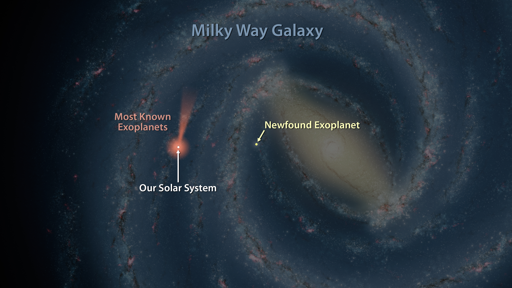

# Foundation for Mathematics : Quantity

**QUANTITY** is the thing we should know before we start learning about mathematics, we use mathematics to express any thing and everything with the help of **QUANTITY**.  

In this section we place a foundation to explore about one of the fundamental of Mathematics i.e **NUMBERS**. 

**NUMBERS** are closely related to **QUANTITY** in physical world. so  will try to understand about quantity and then in next section we explore about how numbers are used express physical world.  

we will explore the importance of **QUANTITY** in human communication, which provides glimpse of how  mathematics is used in our communication for better understanding and better describing of our surrounding. 

For this purpose I have taken a article from NASA website ****[how do stars form and evolve](https://science.nasa.gov/astrophysics/focus-areas/how-do-stars-form-and-evolve)

Since mathematics is the oldest ancient language, let’s travel back in the time and reach at point where universe about takes birth.

## A Story Of A {.} Dot

Our universe started at this {.} dot. The dot at which big bang happened and our universe started expanding and today we are living inside a tiny dot called earth in this ever expanding universe.

We as dot, revolve around the sun. which provides the energy to the life on earth. As our sun in our universe, 1 billion trillion of stars are observed in our observable universe. So stars are very important for our own existence. Hence let’s talk some thing about stars.  

Below are the some of the descriptions taken from NASA's website.


**Description-1:**

Every star in the universe is called as main sequence star. A star in the main sequence is in a state called hydro-static equilibrium. Gravity is pulling the star inward, and the light pressure from all the fusion reactions in the star are pushing outward. The inward and outward forces balance one another in such a way the star maintains a spherical shape. Stars in the main sequence will have a size that depends on their mass, which defines the amount of gravity pulling them inward



**Description-2:**

The lower mass limit for a main sequence star is about 0.1 times the mass of the Sun, or 80 times the mass of Jupiter. This is the minimum amount of gravitational pressure you need to ignite fusion in the core. Stars can theoretically grow to more than 100 times the mass of the Sun


> **We can express about anything in this universe in two ways.**
>
> 1. **Qualitative way**
> 2. **Quantitative way**
>
> \*\*\*\*


**Description-1: Qualitative way of expression**

Describes about stars using plain English grammar. Same thing can be done with Other human languages. Is called as qualitative way describing



**Description-2: Quantitative way of expression**

 **Description-2** consists of **NUMBERS**, for time being  think that **NUMBERS** are not exist and try to read the **Description-2** once again. 

All of a sudden sentences do not make any sense and **we are unable to express relationships like ‘more’, equal’, ’greater’**. We are unable to express our observation in any sort of manner without the help of **NUMBERS**.   


> \*\*\*\*
>
> **Quantity is the one of the fundamental intrinsic property of elements which are present in this universe.**
>
> **Ability of quantifying  and expressing fundamental intrinsic property of an element is the all time greatest discovery of humankind.** 
>
> \*\*\*\*

### Importance of Quantity:

Imagine if we have capability of making stars in this universe. Now if we don’t know how much mass require to kick start nuclear fusion then we are unable to make a star. our decision making capability hinder if we are unable to quantify. 

 To represent quantitative property of an object we use **NUMBERS**. So it is highly important to know about numbers as important to learning and knowing about a human languages.

Before going further, would like to recommend to watch below videos, which helps provide further intuition why we need and learn mathematics.


[Mathematics Explains The Universe](https://www.youtube.com/watch?v=9KM21aBOOmo)

[Leonard Susskind - Why does mathematics work](https://www.youtube.com/watch?v=2bgZmBAnhdg)


